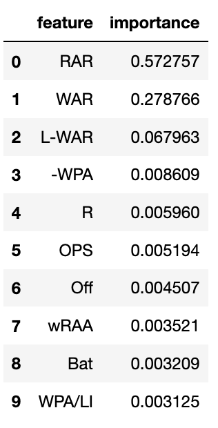

# Home Run Predictor
This code analyzes batting statistics from 2015-2022 in an effort to train a model that can accurately predict how many home runs a player will hit by analyzing his previous season's stats.

## Building the model

### Features
This code uses the pybaseball library to pull _batting stats_ from Baseball Savant from the years 2015-2022. From there, the features are all batting stats provided from 2015-2021. After dropping columns with missing or categorical values, we were left with over 100 features, with some having moderate Pearson coefficient correlation values of ~.6.
The model I chose to run with is using 50 features, and while that is does sacrifice simplicity and performance, I decided to stick with it because of how much better it was performing. When 10 features were used, the mean absolute error(MAE) was 4.14. When 50 features were used, it was 3.18. A roughly 20% accuracy increase was worth it in my opinion, so I continued with 50 features.

### Target
The target value was predicting the following years home run total, given the previous year's statistics. This was generated by tracking home run totals in a Data Frame from 2016-2022.

### Selecting the approrpriate model
After creating the training and test set, I decided to scale the features. From there, I decided to compare 5 ML models:
* Linear Regression
* Support Vector Machine Regression
* Gradient Boosting Regression
* K-Nearest Neighbors Regression
* Random Forest Regression

After evaluating both the root mean squared and median absolute error, the Random Forest performed the best. I moved forward with optimizing this model (baseline mean absolute error of 3.19).  

### Hyperparameters
I then implemented random search with cross validation in order to select the best hyperparameters for the Random Forest Regressor. Six different hyperparameters were tuned in an effort to determine the best combination for our model. After fitting on the training data, it became apparent which hyperparameter values yielded the best results. After completing the random search, I used those results to inform a grid search, and I only tuned _min_samples_leaf_ as a hyperparameter as I performed the grid search.  

### Final Run
The best model returned by the grid search was the one I used for my final run. And in that final run, the mean absolute error was _--2.96_, meaning the model was off by less than 3 home runs per person when predicting next year's home run total.

## Conclusion
After crunching all of the data provided by Statcast, I was able to get within 3 home runs of predicting the following year's homer count. From the outset, the Random Forest Regression model performed the best, with a default MAE of _3.19_. After tuning the hyperparameters, the MAE was _2.96_, which is a .23 decrease, meaning a ~7% increase in accuracy. Additionally, the features most important to the model are shown below:

